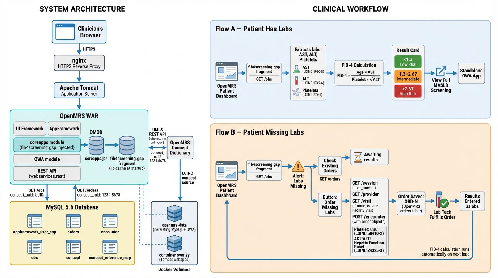

# MASH Care Navigator

## Problem
FIB-4 screening gets missed. High-risk MASLD patients don't get flagged in time.

## What this does
- Optimizes clinical workflow by surfacing lab gaps directly in the provider dashboard
- Automates order generation for missing liver labs — no manual intervention needed
- Calculates FIB-4 score and triggers decision support alerts at point of care
